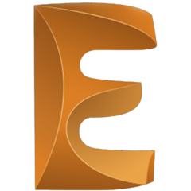
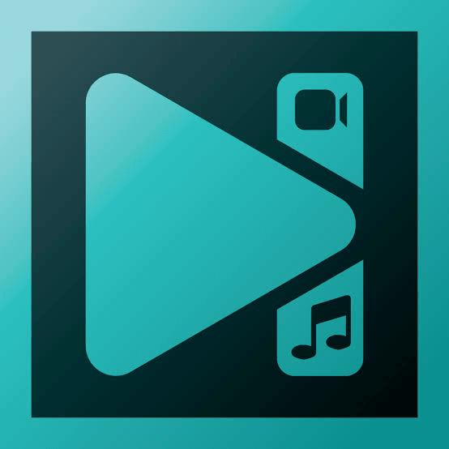

<!-- 
<h2 align="center">10+ Experience | Programmer | Electrical Engineer</h2>
<hr/><br/> -->
<h1 align="center">Hi there </h1>
<!--
##### About me :sunglasses:

---

> I am an energetic, versatile, analytical, IT consultant and ambitious person who has created a mature and responsible outlook for any task that I have been presented with. I am great at working with others to achieve a specific goal on time and with excellence. I am passionate about automation of IT processes and I always strive to achieve the best results.
<br/>

##### Achievements :dart:

---


> With hard-earned knowledge, skills and 12 years of continuous learning, hustle and improvements as an Engineer, I would be able to help other with strong communication and social skills.
<br/>

##### Hard/Soft skills :fire:

---

`Advanced Electronic`  `Electrical House Wiring Design and Development`  `Advance Electrical and Maintenance`  `Electrical Installation and Maintenance`  `Electrical Transmission and Distribution System`  `Solar Energy System`  `Automation System`  `Circuit/PCB Design`  `System Design and Development`  `Graphics Design`  `Web Design and Development`  `Strong communication and social skills`  `Sustainable leadership skills`  `Good analytical skills`  `Problem solving skills`
<br/>

##### Machineries/Tools :hammer_and_wrench:

---

> I have acquired the following hard skills (Machine and Tools operation/maintenance skill) which are not limited...

| Lathe Machine | Shapper Machine | Hobbing Machine | Vertical Milling Machine | Universal Milling Machine | Power press Machine | Welding Machine | Grinding Machine | `Technical problem solving skills` |
--| --| --| --| --| --| --| --| --|


##### Softwares/Tools :wrench:

---

&nbsp;&nbsp;&nbsp;&nbsp;&nbsp;&nbsp;&nbsp;&nbsp;&nbsp;&nbsp;&nbsp;&nbsp;&nbsp;&nbsp;&nbsp;&nbsp;&nbsp;&nbsp;&nbsp;&nbsp;&nbsp;&nbsp;&nbsp;&nbsp;&nbsp;&nbsp;&nbsp;&nbsp;&nbsp;&nbsp;
<br/>

##### Connect with :speech_balloon:

---

[](https://www.twitter.com/404)  [](https://www.instagram.com/404)  [](https://www.linkedin.com/in/404)  [](https://www.github.com/i7amim)  [](https://www.stackoverflow.com/404)  [](https://wa.me/01513******)  [](https://www.discord.com/404)
<br/>
<details><summary>ClickHere</summary>

---

> visit my [portfolio](https://i7amim.github.io/portfolio/) page.
<p>

```
I hereby declare and certify that all of the above information contained in this course vita is true and complete to the best of my knowledge and belief.
```

</p><br/>
<p align="center"><a style="text-decoration:none;" href=""><b>Profile views</b></a><br/></p>

</details>
-->
